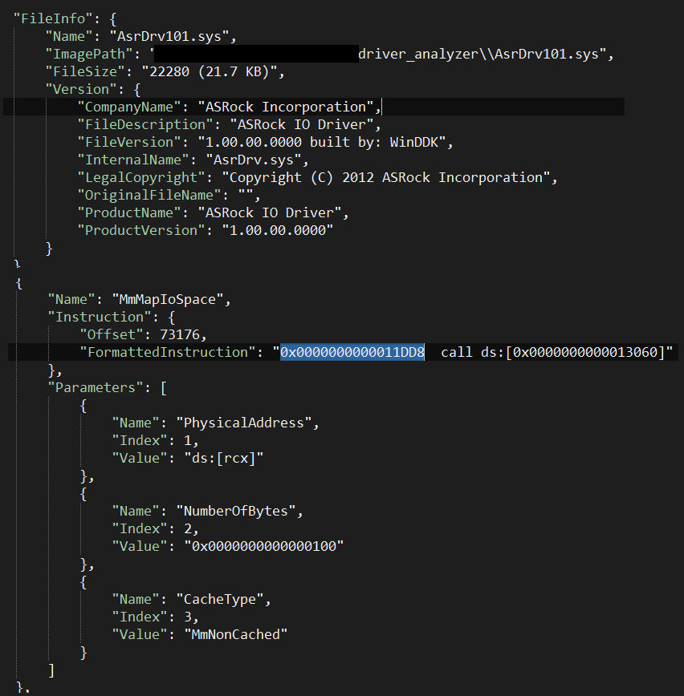
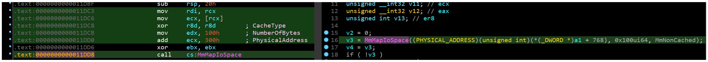

# Driver Analyzer

A static analysis tool that helps security researchers scan a list of Windows kernel drivers for common vulnerability patterns in drivers (CVE makers!)

The generic scan is not robust. It just suggests the potential drivers, but you can write more complex scans for specific APIs. (There is one example in the code tree for [MmMapIoSpace](https://docs.microsoft.com/en-us/windows-hardware/drivers/ddi/wdm/nf-wdm-mmmapiospace) API)

For example, in the following picture, you can see a call to the `MmMapIoSpace` API and its first parameter that is controllable through `rcx` register (first argument in the `fastcall` calling convention), so this one has the potential to be a vulnerable call in the driver, you need to do more investigations manually by reversing the driver.

In the end, if you can find a direct path from the `IOCTL` handler to this function call, congregates you have just found another stupid driver to be exploited.






> Note that this project was part of a larger project, and I just separated it as a standalone tool, so there are some inconsistencies in the code style like namings!

# How to build

You need to have installed these dependencies.

```bat
vcpkg.exe install cereal:x64- indows cereal:x86-windows
vcpkg.exe install zydis:x64-windows zydis:x86-windows
vcpkg.exe install cxxopts:x64-windows cxxopts:x86-windows
vcpkg.exe install lief[pe]:x64-windows lief[pe]:x86-windows
```


# Usage

```bat
Usage:
  Vulnerable Driver Scanner [OPTION...]

  -i, --input arg   Path of directory that contains Driver files (*.sys)
  -o, --output arg  Full name of JSON report
  -b, --backup arg  Path of backup directory to have a copy of suspicious
                    driver files
```